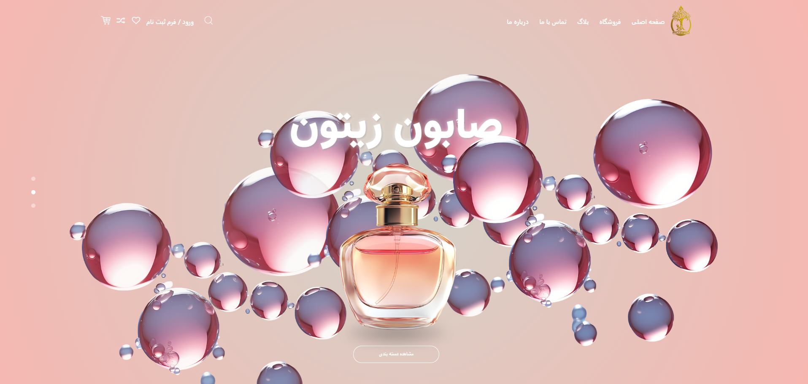
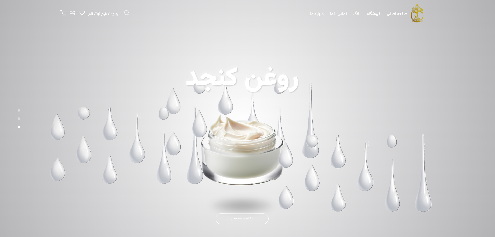
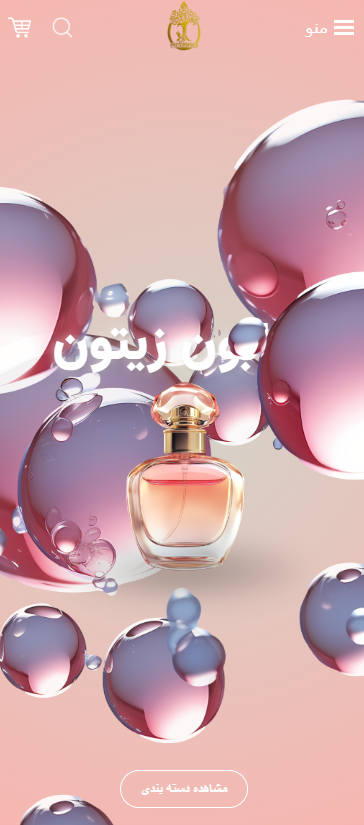

# 🌸 Beauty Products 3D Animation Challenge

A modern interactive hero slider built with **React + Swiper.js**, featuring smooth **3D animations**, **scroll-triggered transitions**, and a fully **responsive mobile view**.  
This project was developed as part of a challenge to demonstrate animation, responsiveness, and UI design skills.

---

## 🚀 Features

- 🎞️ **3D Center Image Animation** – Product images smoothly transition from bottom to top between slides.  
- 📱 **Responsive Design** – Works seamlessly across desktop and mobile devices.  
- 🎨 **Petal & Splash Effects** – Floating decorative assets with entrance/exit animations.  
- 🖼️ **Hero Section Layout** – Includes title, product, effects, and CTA button.  
- ⚡ **Swiper.js Integration** – Smooth vertical slide transitions with mouse scroll support.  

---

## 📸 Demo Preview

Here are some actual screenshots from the project:

### 🖥️ Desktop View




### 📱 Mobile View




---

## 🛠️ Tech Stack

- **Frontend Framework:** React.js  
- **Styling:** CSS3 (animations, transitions)  
- **Slider & Animations:** Swiper.js  
- **3D & Interactive Effects:** Custom CSS keyframes, transitions, floating effects  
- **Build Tool:** Create React App (CRA)  
- **IDE & Tools:** Visual Studio Code, Git & GitHub Desktop  
- **Deployment:** Netlify   

---

## 📂 Project Setup

Clone the repository:

```bash
git clone https://github.com/lawr3ncey/beauty-product-challenge
cd beauty-product-challenge

Install dependencies:

npm install


Run locally:

npm start


Build for production:

npm run build


✨ Credits

Developed with ❤️ as part of a frontend animation challenge.
Special thanks to the reviewers for feedback and guidance.


---


📌 Notes

Designed to showcase animation & responsiveness for beauty products.

Works on modern browsers and devices.

Easily customizable: update slides array in HeroSlider.js to change images/text.

👤 Author

Developed by Lawrence Babelonia - babelonialawrence@gmail.com
For challenge submission & portfolio purposes.

---

👉 **https://3d-beauty-product.netlify.app/** 